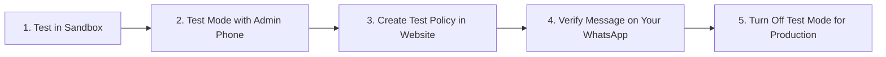

# Complete Step-by-Step Meta WhatsApp Cloud API Setup Guide
**For InsureLedger Insurance Management Platform**

---

## 📌 Table of Contents
1. [Overview & Architecture](#1-overview--architecture)
2. [Phase 1: Meta Developer Account & App Creation](#2-phase-1-meta-developer-account--app-creation)
3. [Phase 2: Immediate Sandbox Testing (Testing With Yourself First - Zero Cost)](#3-phase-2-immediate-sandbox-testing)
4. [Phase 3: Registering a Real/Permanent Business Phone Number](#4-phase-3-registering-a-realpermanent-business-phone-number)
5. [Phase 4: Adding Payment Method / Card & Understanding Pricing](#5-phase-4-adding-payment-method--card--pricing)
6. [Phase 5: Meta Business Profile Verification](#6-phase-5-meta-business-profile-verification)
7. [Phase 6: Creating Message Templates for Instant Meta Approval](#7-phase-6-creating-message-templates)
8. [Phase 7: Generating a Permanent System User Access Token (Never Expires)](#8-phase-7-generating-a-permanent-system-user-token)
9. [Phase 8: Webhook Setup for Real-time Delivery & Read Receipts](#9-phase-8-webhook-setup)
10. [Phase 9: Live Testing Checklist & Switching from Test Mode to Production](#10-phase-9-live-testing-checklist)

---

## 1. Overview & Architecture

Your website has been equipped with native support for the **official Meta WhatsApp Cloud API**.

### Automated WhatsApp Notifications:
1. **Policy Issued / Record Added**:
   - Sent when a new insurance policy entry is created or renewed.
   - **Attributes Included**:
     - `{{1}}` Customer Name (e.g. *Rahul Sharma*)
     - `{{2}}` Vehicle Number (e.g. *MH 12 AB 1234*)
     - `{{3}}` Policy Number (e.g. *POL-2026-9912*)
     - `{{4}}` Insurance Company (e.g. *HDFC ERGO General Insurance*)
     - `{{5}}` Expiry Date (e.g. *2027-09-25*)
     - `{{6}}` Total Premium (e.g. *INR 14,500.00*)
     - `{{7}}` Paid Amount (e.g. *INR 5,000.00*)
     - `{{8}}` Outstanding Balance (e.g. *INR 9,500.00*)

2. **Payment Receipt / Payment Added**:
   - Sent when a payment transaction is recorded against an insurance policy.
   - **Attributes Included**:
     - `{{1}}` Customer Name (e.g. *Rahul Sharma*)
     - `{{2}}` Vehicle Number (e.g. *MH 12 AB 1234*)
     - `{{3}}` Receipt / Payment ID (e.g. *RCP-1042*)
     - `{{4}}` Paid Amount (e.g. *INR 5,000.00*)
     - `{{5}}` Payment Date (e.g. *2026-09-25*)
     - `{{6}}` Payment Mode (e.g. *UPI / Cash / Card*)
     - `{{7}}` Remaining Outstanding Balance (e.g. *INR 4,500.00*)

### 🛡️ Built-in Safe "Test Mode" Protection
> **Important:** Your website settings have **Test Mode** enabled by default. As long as Test Mode is active and your Admin Test Phone Number is set, all outgoing notifications will be redirected to **your phone only**. No actual clients will ever receive automated messages until you toggle Test Mode off.

---

## 2. Phase 1: Meta Developer Account & App Creation

1. Open your browser and navigate to **[Meta for Developers](https://developers.facebook.com/)**.
2. Log in with your standard Facebook account (or create one).
3. If this is your first time, click **Get Started** in the top-right corner to accept the developer terms.
4. Click **My Apps** in the top navigation bar, then click **Create App**.
5. Select **Other** (or "Business") as the use case $\rightarrow$ Click **Next**.
6. Select the app type **Business** $\rightarrow$ Click **Next**.
7. Enter App Details:
   - **App Name**: `InsureLedger Agency` (or your agency brand name).
   - **App Contact Email**: Your official business email.
   - **Business Account**: Select your Meta Business Portfolio / Business Manager account (if you don't have one, Meta will automatically prompt you to create one).
8. Click **Create App** and enter your Facebook password if prompted.
9. On the App Dashboard under "Add products to your app", locate **WhatsApp** and click **Set up**.

---

## 3. Phase 2: Immediate Sandbox Testing
*(Test everything right away using your own phone number with zero charges)*

Meta gives you a **free test sender number** and **24-hour temporary access token** so you can verify the integration before adding payment cards or business documents.

### Step 1: Add Your Personal Number to the Allowlist
1. In your Meta Developer App, go to the left sidebar $\rightarrow$ Click **WhatsApp** $\rightarrow$ **API Setup**.
2. Under **Step 1: Select phone numbers**:
   - You will see a pre-assigned test number (e.g., `+1 555 0...`).
   - Notice your **Phone number ID** (a ~15-digit number) and **WhatsApp Business Account ID**.
3. Under **Step 2: Send and receive messages**:
   - In the **To** dropdown, select **Manage phone number list**.
   - Enter your personal WhatsApp phone number (select your country code, e.g. `+91` for India, and enter your 10-digit number).
   - Meta will send a 6-digit verification code to your WhatsApp. Enter the code to verify.
   - Your number is now authorized to receive test messages.

### Step 2: Configure Your Website with the Test Credentials
1. On the **API Setup** page:
   - Copy the **Temporary access token**.
   - Copy the **Phone number ID**.
   - Copy the **WhatsApp Business Account ID**.
2. Open your website: Go to **Settings** $\rightarrow$ Click the **WhatsApp Meta API** tab.
3. Paste the **Phone number ID**, **WABA ID**, and **Temporary access token**.
4. In **Admin Test Phone Number**, enter your verified phone number (e.g. `919876543210`).
5. Ensure **Enable Test Mode** is checked.
6. Click **Save WhatsApp Configuration**.
7. In the **Test WhatsApp Sending** box on the right:
   - Select **Direct Text Ping (Testing Sandbox)**.
   - Click **Send Live Test Message**.
   - **Result**: You will immediately receive a WhatsApp message on your phone!

---

## 4. Phase 3: Registering a Real/Permanent Business Phone Number

When you are ready to send messages from your agency's official number rather than the test sandbox:

### ⚠️ Phone Number Prerequisites:
- The phone number **cannot be currently registered on WhatsApp** (neither the consumer WhatsApp App nor the WhatsApp Business App).
- If your number is currently used on the WhatsApp mobile app:
  1. Open WhatsApp on that phone.
  2. Go to **Settings** $\rightarrow$ **Account** $\rightarrow$ **Delete My Account**.
  3. (Alternatively, obtain a fresh virtual number, landline, or a new SIM card dedicated for API notifications).
- The number must be capable of receiving an SMS or Voice OTP call.

### Adding the Number in Meta:
1. In Meta Developer Portal $\rightarrow$ Go to **WhatsApp** $\rightarrow$ **API Setup**.
2. Scroll to the bottom to **Step 5: Add a phone number to your WhatsApp account** $\rightarrow$ Click **Add Phone Number**.
3. Fill in your Business Profile:
   - **WhatsApp Business Display Name**: Must closely match your registered business name or website brand (e.g., *InsureLedger Services*).
   - **Category**: *Finance & Banking* or *Professional Services*.
   - **Business Description**: (e.g., *Automated policy and payment receipts for insurance clients*).
4. Enter the phone number and select verification method (**Text Message / SMS** or **Phone Call**).
5. Enter the 6-digit OTP code received on your phone.
6. Once verified, Meta assigns a permanent **Phone number ID** to this real number.
7. Copy this new **Phone number ID** and update it in your website **Settings** $\rightarrow$ **WhatsApp Meta API** tab.

---

## 5. Phase 4: Adding Payment Method / Card & Pricing

WhatsApp Cloud API requires a valid payment method on file in your Meta Business Suite before you can send template messages from a real number to outside customers.

### How to Add Your Credit / Debit Card:
1. Open **[Meta Business Suite](https://business.facebook.com/billing_hub)**.
2. In the top-left account selector, choose your **Business Portfolio**.
3. Click **Billing & Payments** in the left menu (or go to [business.facebook.com/settings/payment-methods](https://business.facebook.com/settings/payment-methods)).
4. Click **Payment Methods** $\rightarrow$ Click **Add Payment Method**.
5. Select your country and currency (e.g., **INR - Indian Rupee** or **USD**).
6. Enter your Credit Card or Debit Card details (Visa, Mastercard, or Amex).
   > *Note for India:* Ensure International Transactions and Online Recurring/E-mandate payments are enabled on your card banking app.
7. Link the payment method to your **WhatsApp Business Account**.

### Pricing Structure (Utility Templates):
- **Free Allowance**: 1,000 Service (user-initiated customer support) conversations per month are completely free.
- **Utility Conversations (Our Notifications)**:
  - Both Policy Issued and Payment Receipt templates are classified under the **Utility** category.
  - In India, Meta charges approximately **₹0.12 to ₹0.35 per 24-hour conversation window**.
  - All messages sent to the same customer within 24 hours of the first message are covered under a single conversation fee.
- **Monthly Spending Limit**: You can set a monthly threshold (e.g. ₹500 or ₹1,000) under *Billing & Payments* to ensure no unexpected billing occurs.

---

## 6. Phase 5: Meta Business Profile Verification

Verification confirms your organization's legal identity. Unverified businesses have a starting tier of 250 business-initiated conversations per 24 hours (which is plenty for initial testing). Business Verification unlocks 1,000 to unlimited conversations/day.

### Documents Needed:
- **Legal Business Name**: GST Certificate, Udyam / MSME Registration Certificate, Certificate of Incorporation, or Partnership Deed.
- **Business Address & Phone Proof**: Utility bill (electricity, telephone, internet) or bank account statement matching the business legal name and address exactly.
- **Website Domain**: Your live website URL (e.g. `https://yourdomain.com`).

### Steps to Verify:
1. Open **[Meta Business Settings](https://business.facebook.com/settings/)**.
2. Select your business portfolio.
3. In the left navigation, scroll down and click **Security Center**.
4. Under **Business Verification**, click **Start Verification**.
5. Fill in your official Organization Details:
   - Legal Name (must match your GST/registration document word-for-word).
   - Address and official contact phone number.
   - Business website domain.
6. Upload the supporting document (e.g., GST Certificate PDF).
7. Select verification method: **Email to official domain** (e.g. `admin@yourdomain.com`) or **Phone OTP**.
8. Submit. Turnaround time is typically **24 to 72 hours**.

---

## 7. Phase 6: Creating Message Templates

For business-initiated notifications outside a 24-hour conversation window, Meta requires pre-approved **Utility** message templates.

### How to Create Templates in WhatsApp Manager:
1. Go to **Meta Developer Portal** $\rightarrow$ **WhatsApp** $\rightarrow$ **Quick Links** $\rightarrow$ Click **WhatsApp Manager** (or visit [business.facebook.com/wa/manage/message-templates](https://business.facebook.com/wa/manage/message-templates)).
2. Click the **Create Template** button.
3. Follow the specifications below for each template:

---

### Template 1: Policy Issued Notification
- **Category**: Select **Utility** *(Fastest approval, lowest cost)*.
- **Template Name**: `insurance_policy_issued` *(Must be all lowercase with underscores)*.
- **Language**: `English` (code: `en`).
- **Header**: None (or optional Text header: `Insurance Policy Issued`).
- **Body Text** *(Copy and paste the exact text below)*:
```text
Dear {{1}}, your vehicle insurance for {{2}} has been issued successfully.

*Policy Details:*
• Policy Number: {{3}}
• Insurance Company: {{4}}
• Valid Till: {{5}}
• Total Premium: {{6}}
• Amount Paid: {{7}}
• Outstanding Balance: {{8}}

Thank you for choosing our services. Please contact us if you have any questions.
```
- **Sample Values for Approval** *(Meta's AI requires realistic sample values to approve)*:
  - `{{1}}`: `Rahul Sharma`
  - `{{2}}`: `MH 12 AB 1234`
  - `{{3}}`: `POL-2026-9912`
  - `{{4}}`: `HDFC ERGO General Insurance`
  - `{{5}}`: `2027-09-25`
  - `{{6}}`: `INR 14,500.00`
  - `{{7}}`: `INR 5,000.00`
  - `{{8}}`: `INR 9,500.00`
- Click **Submit**. Approval for Utility templates typically takes **1 to 15 minutes**.

---

### Template 2: Payment Receipt Notification
- **Category**: Select **Utility**.
- **Template Name**: `payment_receipt_collected` *(Must be all lowercase with underscores)*.
- **Language**: `English` (code: `en`).
- **Body Text** *(Copy and paste the exact text below)*:
```text
Dear {{1}}, we have received your payment of {{4}} for vehicle {{2}}.

*Payment Receipt:*
• Receipt ID: {{3}}
• Amount Paid: {{4}}
• Payment Date: {{5}}
• Payment Mode: {{6}}
• Remaining Outstanding: {{7}}

Thank you for your prompt payment!
```
- **Sample Values for Approval**:
  - `{{1}}`: `Rahul Sharma`
  - `{{2}}`: `MH 12 AB 1234`
  - `{{3}}`: `RCP-1042`
  - `{{4}}`: `INR 5,000.00`
  - `{{5}}`: `2026-09-25`
  - `{{6}}`: `UPI`
  - `{{7}}`: `INR 4,500.00`
- Click **Submit**.

---

## 8. Phase 7: Generating a Permanent System User Token
*(Temporary tokens expire in 24 hours. A System User token never expires!)*

1. Go to **[Meta Business Settings](https://business.facebook.com/settings/)**.
2. In the left navigation under **Users**, click **System Users**.
3. Click **Add** (or "Create System User"):
   - **System User Name**: `InsureLedger Auto Sender`.
   - **System User Role**: Select **Admin**.
   - Click **Create System User**.
4. Click **Assign Assets**:
   - Under **Apps**, select your Meta Developer App (`InsureLedger Agency`).
   - Enable the toggle **Full Control (Manage App)** $\rightarrow$ Click **Save Changes**.
5. Under the same System User, click **Generate New Token**:
   - **Select App**: Choose your Meta App.
   - **Token Expiration**: Select **Never** (Permanent).
   - In the permissions list, check:
     - `whatsapp_business_messaging`
     - `whatsapp_business_management`
   - Click **Generate Token**.
6. **Copy the token immediately and save it securely!** Meta only shows it once.
7. Go to your website: **Settings** $\rightarrow$ **WhatsApp Meta API** tab.
8. Paste the permanent token in the **System User Permanent Access Token** field $\rightarrow$ Click **Save WhatsApp Configuration**.

---

## 9. Phase 8: Webhook Setup
*(Enables real-time delivery and read receipts in your dashboard)*

1. In your Meta Developer App, open the left sidebar $\rightarrow$ Click **WhatsApp** $\rightarrow$ **Configuration**.
2. In the **Webhook** card, click **Edit**:
   - **Callback URL**: `https://your-domain.com/api/whatsapp/webhook/` (or copy it directly using the "Copy Webhook URL" button in your website's WhatsApp settings tab).
   - **Verify Token**: `insure_wa_webhook_secret_key` (matches the Verify Token in your website settings).
3. Click **Verify and Save**. Meta will send a GET challenge request; your website will automatically verify it and respond with `200 OK`.
4. Click **Manage Webhook Fields**:
   - Locate the **`messages`** row.
   - Click **Subscribe**.
5. Done! Whenever a WhatsApp message is delivered or read by a customer, Meta will notify your website to update the message status in real-time.

---

## 10. Phase 9: Live Testing Checklist

Before sending messages to real customers, follow this simple checklist:



1. **Verify Test Mode is Active**:
   - Go to **Settings** $\rightarrow$ **WhatsApp Meta API**.
   - Verify **Enable Test Mode** is checked.
   - Set **Admin Test Phone Number** to your own personal phone number.
2. **Test Automated Policy Creation**:
   - Go to **Insurance Records** $\rightarrow$ Click **New Insurance Record**.
   - Create a policy with any sample customer name and details.
   - Look at your phone: You will receive the policy issued WhatsApp message with customer name, vehicle, premium, and balance!
3. **Test Automated Payment Receipt**:
   - Open that policy record $\rightarrow$ Click **Make Payment**.
   - Enter a test payment (e.g. ₹2,000 via UPI).
   - Look at your phone: You will receive the official payment receipt message with Receipt ID, paid amount, and updated outstanding balance!
4. **Inspect Audit History**:
   - Go to **Settings** $\rightarrow$ **WhatsApp Meta API** tab.
   - Review the **Recent WhatsApp Delivery Logs** table to see the message ID, delivery status, and timestamps.
5. **Switch to Production**:
   - When you are ready to send live messages to actual clients:
   - Uncheck **Enable Test Mode**.
   - Click **Save WhatsApp Configuration**.
   - Your system is now in **Live Production Mode**!
